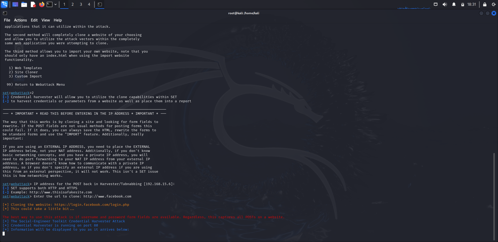

# Roteiro de ações para aplicar o teste do Fishing para capturar login e senha do Facebook:
- Este tipo de ataque de fishing é válido para qualquer tipo de página Web para captura de login e senha
- **Atenção : esta técnica é apenas didática para fins de demonstração dos riscos potenciais de clicar em links contidos em mensagens de texto de origem duvidosa.
## Instalação da maquina virtual (VMBOX)
## Instalação do Kali Linux 
### Criação de uma conta de perfil de teste do Facebook
## Link da página de login do Facebook : https://www.facebook.com/login.php/


### Configurando o Phishing no Kali Linux
- Abrir o terminal no kali linux e seguir os passoas a seguir:
- Acesso root: digitar ``` sudo su ```
- Digitar a senha do Kali: ````kali ````
- Iniciando o setoolkit: Digite ``` setoolkit ``` e dê "Enter"
- Tipo de ataque: Escolha a opção ``` Social-Engineering Attacks ``` e digite o número correspondente
- Vetor de ataque: Escolha a opção ``` Web Site Attack Vectors ``` e digite o número correspondente
- Método de ataque: Escolha a opção ```Credential Harvester Attack Method ``` e digite o número correspondente
- Método de ataque: Escolha a opção ``` Site Cloner ``` e digite o número correspondente
- Obtendo o endereço da máquina: ``` ifconfig ```
- URL para clone: http://www.facebook.com

## Tela inicial do SETOOLKIT:


## Tela do Setoolkit em operação de clonagem da URL:



