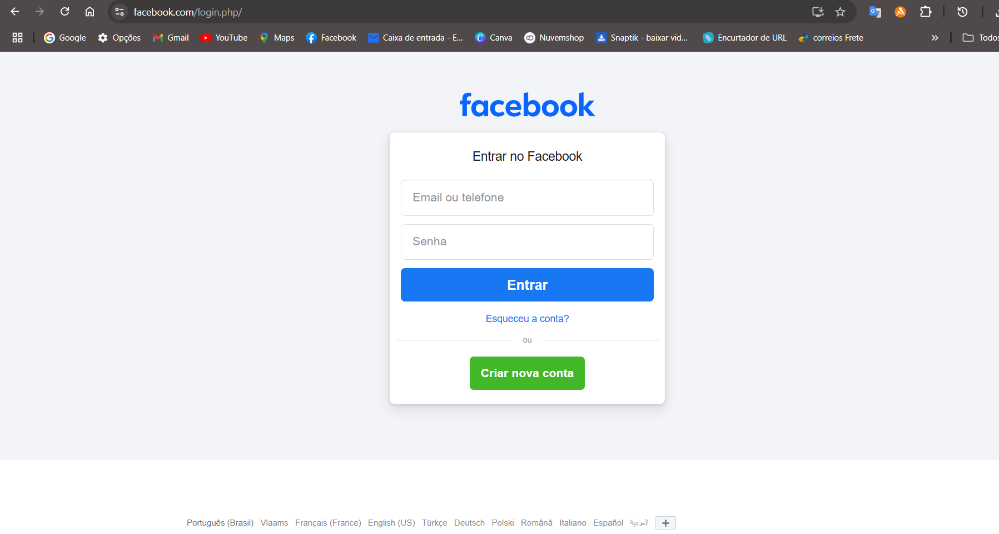
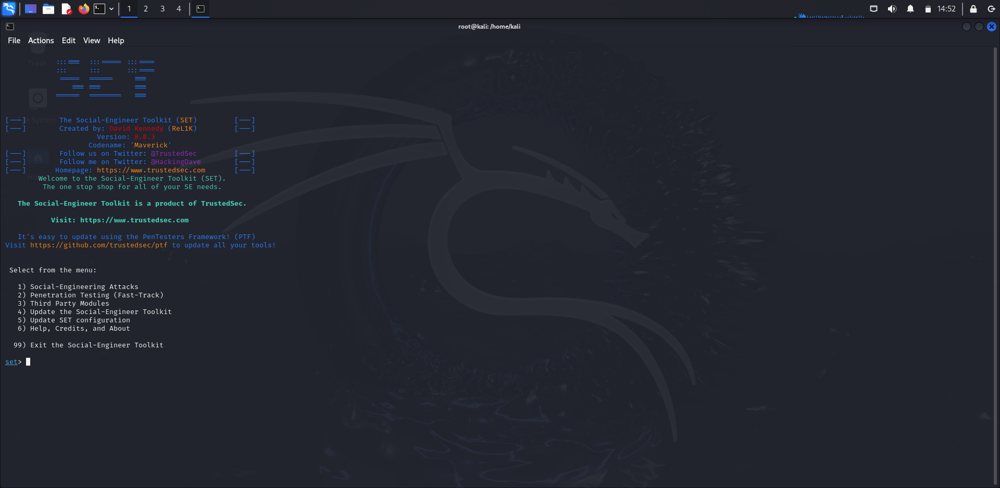

# Roteiro de ações para aplicar o teste do Fishing para capturar login e senha do Facebook:
## Instalação da maquina virtual (VMBOX)
## Instalação do Kali Linux 
### Criação de uma conta de perfil de teste do Facebook
## Link da página de login do Facebook : https://www.facebook.com/login.php/



### Configurando o Phishing no Kali Linux
- Abrir o terminal no kali linux e seguir os passoas a seguir:
- Acesso root: digitar ``` sudo su ```
- Digitar a senha do Kali: ````kali ````
- Iniciando o setoolkit: Digite ``` setoolkit ``` e dê "Enter"
- Tipo de ataque: Escolha a opção ``` Social-Engineering Attacks ``` e digite o número correspondente
- Vetor de ataque: ``` Web Site Attack Vectors ```
- Método de ataque: ```Credential Harvester Attack Method ```
- Método de ataque: ``` Site Cloner ```
- Obtendo o endereço da máquina: ``` ifconfig ```
- URL para clone: http://www.facebook.com



